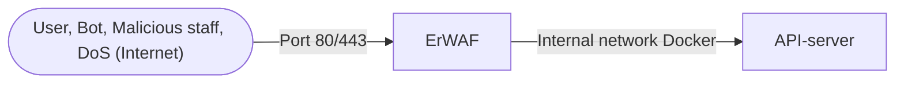
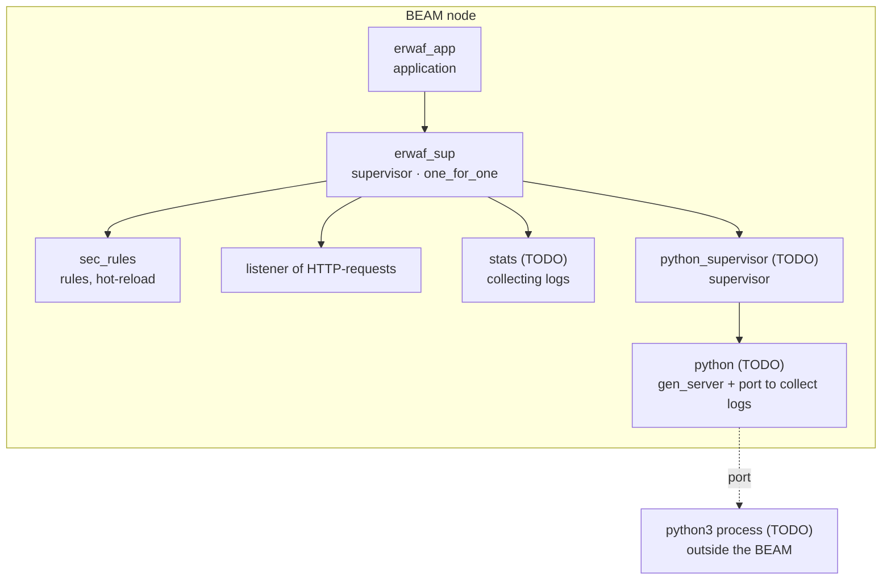

ErWAF
=====

ErWAF is a naive implementation of Web Application Firewall written in Erlang for educational purposes.
This project is created to study the basics of Erlang, WAF and demonstrate the results.

<!-- Build
-----

    rebar3 compile -->

---

### Testing in shell
Run in a terminal

    % rebar3 shell
    1> listener:start().

Run the requests below in another terminal with httpie (https://httpie.io/docs/cli/installation)

Good requests:

    http -v GET localhost:8081/api/v1/users/123 hello=world
    http -v -f POST 'localhost:8081/api/v1/post?id=123' hello=World
    http -v DELETE localhost:8081/item/1
    http -v PUT localhost:8081/put name=John email=john@example.org
    http -v PUT localhost:8081/put \
        name=John \
        age:=29 \
        married:=false \
        hobbies:='["http", "pies"]' \
        favorite:='{"tool": "HTTPie"}' \
        bookmarks:=@./data.json
    http -v HEAD "localhost:8081/"

Bad requests:

    http -v GET localhost:8081/api/'SELECT * from Users;--' 'username=Select * from Users;--'
    http -v GET localhost:8081/api/'select * from Users;--' "username=UPDATE users SET pass = '1' where user = 't1' OR 1=1--"
    http -v GET localhost:8081/api/"username=SELECT * from table where id = 1 union select 1,2,3"
    http -v GET "localhost:8081/user/admin' OR '1'='1"
    http -v -f POST localhost:8081/post/'userid=SELECT * from Users where 1=1;--' "username=SELECT * from table where id = 1 union select 1,2,3"
    http -v DELETE localhost:8081/item/'Select * From Items where 1=1;--'
    http -v PUT localhost:8081/put name='DROP TABLE Users;' email=john@example.org
    http -v GET "localhost:8081/query="
    http -v HEAD "localhost:8081/'Select * From Items where 1=1;--'"
    http -v PUT localhost:8081/put \
        name=John \
        age:=29 \
        married:=false \
        hobbies:='["http", "pies"]' \
        favorite:='{"tool": "HTTPie"}' \
        description=@./notes.txt

## Architecture

### Overview

### In details

